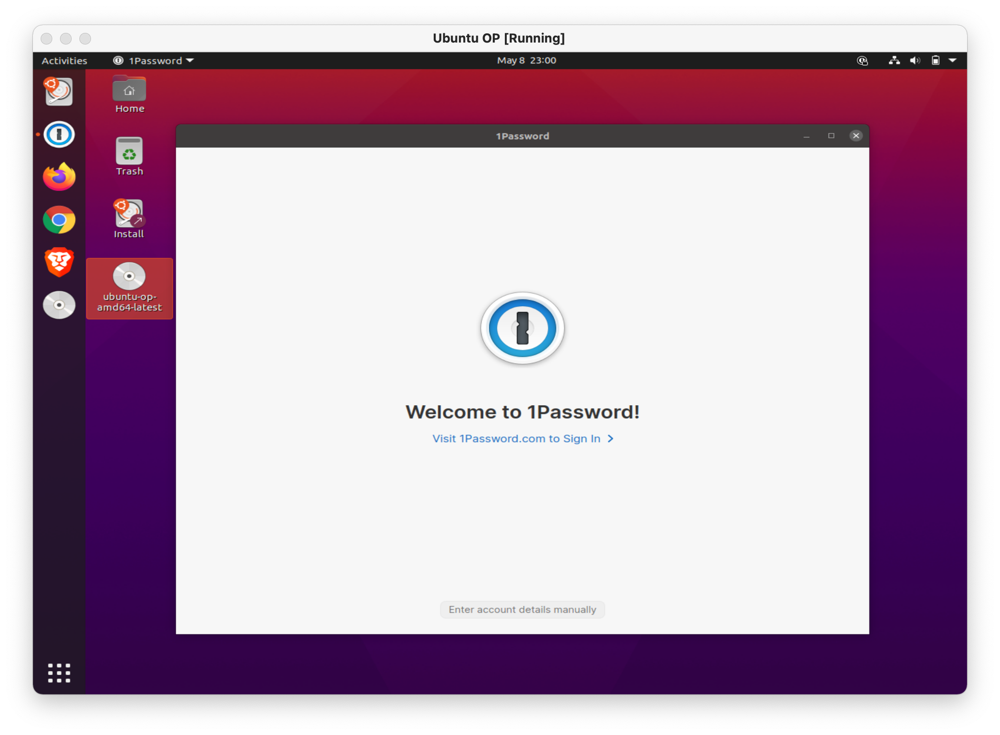

# Ubuntu OP

A custom-built version of Ubuntu Desktop with 1Password for Linux and 1Password officially supported browsers preinstalled. Ubuntu OP is ideal for testing as a live reproducible environment or provides a quick way for folks not familiar with Linux to install Ubuntu with 1Password.

   

## What's inside

- An up to date version of Ubuntu 20.10 for x86_64
- The latest version of 1Password for Linux Beta
- The following browsers with 1Password in your browser set to install on launch
  - Firefox Stable
  - Google Chrome Stable
  - Microsoft Edge Beta
  - Brave Stable (1Password [not installed by default](https://github.com/beyera/ubuntu-op/issues/1))

## Possible uses

- To try out 1Password for Linux without needing to fuss about how to install applications on Linux.
- You need to quickly bootstrap a VM and run 1Password.
- You use 1Password and Ubuntu and want a ton of browsers installed by default.
- Testing 1Password in a clean and reproducible environment.

## FAQ

### Where can I get the iso image?

To stay up to date and useful, new versions are created daily. Download the [latest build here](https://1pw.dev/download/ubuntu-op-amd64-latest.iso).

Once you have the iso downloaded, you can use it to boot in a virtual machine application, like:

- [VirtualBox](https://www.virtualbox.org/)
- [Parallels](https://www.parallels.com)
- [VMware](https://www.vmware.com/products/workstation-pro.html)
- [With Hyper-V on Windows](https://docs.microsoft.com/en-us/virtualization/hyper-v-on-windows/quick-start/quick-create-virtual-machine)

Or you can create a bootable USB stick on [macOS](https://ubuntu.com/tutorials/create-a-usb-stick-on-macos#1-overview), [Windows](https://ubuntu.com/tutorials/create-a-usb-stick-on-windows#1-overview), or [Linux](https://ubuntu.com/tutorials/create-a-usb-stick-on-ubuntu#1-overview).

I guess you could technically burn it to one of those DVD things too, but that feels like a waste.

### Why did you make this?

A few reasons:

- Github has actions that are entirely free for public repositories. With a little bit of automation magic, I now have an up-to-date version of Ubuntu with the latest version of 1Password and supported browsers.
- I [came across someone who did](https://github.com/mvallim/live-custom-ubuntu-from-scratch) a lot of the hard work creating the underlying scripts which allowed me to create a 1Password version of Ubuntu quickly.
- I couldn't sleep because my brain wanted to do this.

### Why are so many browsers included?

One of the things I use this iso for is testing 1Password for Linux with the some of the browsers 1Password lists as [fully supported](https://support.1password.com/getting-started-browser/). Feel free to file an issue or PR if you want a solo-browser built.

### Who made it?

- **Andrew Beyer** - Maintainer of this fork and developer of customizations.
- **Marcos Vallim** - All credit for the underlying scripts and awesome documentation goes to to [mvallim](https://github.com/mvallim) and the other [contributors](https://github.com/mvallim/live-custom-ubuntu-from-scratch/blob/master/CONTRIBUTORS.txt) of [mvallim/live-custom-ubuntu-from-scratch](https://github.com/mvallim/live-custom-ubuntu-from-scratch).

## TODO

- Create SHA256 checksum and sign it using GPG on every iso creation.
- Test updating to Ubuntu 21.04
- Some fun customizations
  - Default wallpaper
  - Add 1Password to Gnome Dash
- Create a sweet landing/download page. In the meantime, you can grab the [latest version here](https://1pw.dev/download/ubuntu-op-amd64-latest.iso).

## For the suits

### License

This project is licensed under the Apache License - see the [LICENSE](LICENSE) file for details.

The artifacts built by this project install code from multiple open source projects as well as public software repositories for the following companies:

- 1Password (1Password for Linux, 1Password CLI)
- Brave (Browser)
- Google (Chrome)
- Microsoft (Edge)
- Mozilla (Firefox)

### Disclaimer

None of the companies listed above officially endorse this project. You assume your own risk by using any of the generated artifacts.
